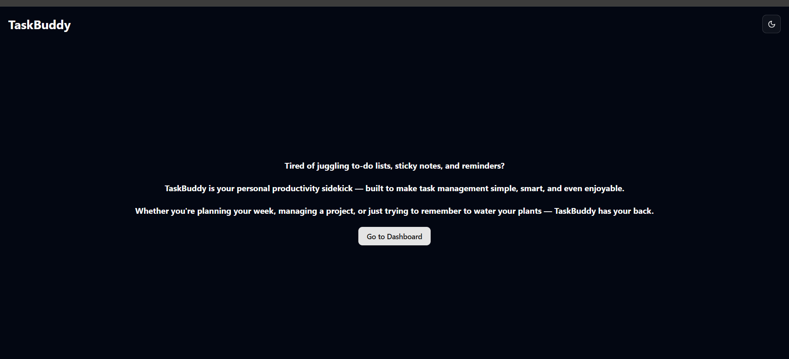

# Taskbuddy
TaskBuddy is your personal productivity sidekick — meticulously built to make task management simple, smart, and even enjoyable. We understand the challenges of modern life, and that's why we've designed an intuitive platform that adapts to your unique needs.
## 📸 Screenshot




---

## 📦 Setup Instructions

### STEP 01 - Clone the Project

```bash
git clone https://github.com/yourusername/ai-task-manager.git
```


### ✅ STEP 02- Install Dependencies

```bash
npm install
```

### ✅ STEP 03 - Create .env Files

```bash
DATABASE_URL="your_neon_postgres_url"
GEMINI_API_KEY="your_gemini_key"
```


✅ STEP 04 - Run with Docker Compose

```bash
docker-compose up --build

```
